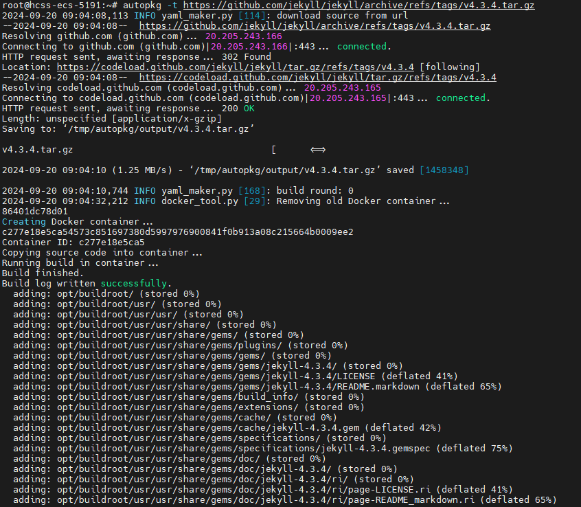

# autopkg User Guide

## Overview

This software streamlines package integration for the openEuler community by automating the bulk import of source code repositories from public platforms like GitHub. It detects package dependencies and generates binary files automatically, eliminating the need for manual package writing and maintenance. With built-in support for cMake, autotools, Meson, Maven, and Python build systems, the software substantially increases the success rate of end-to-end package integration.

## Installation and Uninstallation

### 1. Installation

Download the source code from the repository.

```bash
git clone https://gitee.com/qiu-tangke/autopkg.git -b ${branch}
```

Navigate to the repository directory and install the software using `pip`. This is compatible with openeuler 22.03 LTS and newer versions. For other versions, ensure that a Python 3.8 or higher environment is available.

```bash
pip install dist/autopkg-***-py3-none-any.whl
```

### 2. Uninstallation

```bash
pip uninstall autopkg
```

## Quick Start

### 1. Environment Preparation

The software must run on the host machine and requires Docker container support. Prepare a Docker image of the openEuler OS using the following methods.

#### Method 1: Direct Image Acquisition from Source Repository

```bash
arch=$(uname -m)
if [ "$arch" == "aarch64" ]; then
    wget https://cache-openeuler.obs.cn-north-4.myhuaweicloud.com/52f2b17e15ceeefecf5646d7711df7e94691ea1adb11884b926532ae52ab3c22/autopkg-latest_aarch64.tar.xz
    docker load < autopkg-latest_aarch64.tar.xz
elif [ "$arch" == "x86_64" ]; then
    wget https://cache-openeuler.obs.cn-north-4.myhuaweicloud.com/710a5f18188efc70bfa0119d0b35dcbb62cab911c9eb77b86dc6aebdbbfc69de/autopkg-latest_x86-64.tar.xz
    docker load < autopkg-latest_x86-64.tar.xz
else
    echo "Error: The system architecture is neither aarch64 nor x86_64, it is $arch."
fi
```

#### Method 2: Manual Image Construction via Commands (in Case Method 1 Fails)

```bash
arch=$(uname -m)
wget "https://repo.huaweicloud.com/openeuler/openEuler-23.03/docker_img/${arch}/openEuler-docker.${arch}.tar.xz"
docker load < "openEuler-docker.${arch}.tar.xz"
docker run -dti --privileged --name=autopkg_working --network=host openEuler-23.03:latest
docker exec -ti ${container_id} bash  # The following commands are executed inside the container.
yum install -y git make gcc cmake python3-pip ruby ruby-devel rubygems-devel npm maven automake perl wget curl meson
cat >> /root/phase.sh << EOF
#/usr/bin/env bash

prep
build
install
EOF
exit  # Exit the container.
docker commit ${container_id} > autopkg:latest  # Save the container modifications.
docker tag ${new_image_id} autopkg:latest  # Name and tag the image.
```

### 2. Command Line

```bash
autopkg --help
-g,--git-url:  Provide the git repository URL, for example, 'https://***.git'.
-t,--tar-url:  Provide the tar package URL.
-d,--dir:      Specify the local repository path.
-n,--name:     Specify the package name, used for interface request information.
-v,--version:  Specify the version, used with "-n".
-l,--language: Specify the language, used with "-n".
-o,--output:   Set the output file path.
-b,--build:    Enable debug log mode.
-c,--config:   Provide directly usable configuration information.
```

### 3. Common Commands

#### A. Specifying Local Repository Path

```bash
autopkg -d ${package_dir} -o ${output_path}
```


#### B. Specifying Source Package URL

```bash
autopkg -t ${tar_url} -o ${output_path}
```



#### C. Specifying Package Name without Compilation

```bash
autopkg -n ${name} -v ${version} -l ${language} -o ${output_path}
```


## Output File Description

Upon successful package compilation, the system generates **package.yaml**, **phase.sh**, and **{package_name}.epkg**. If compilation is skipped, only **package.yaml** and **phase.sh** are produced. The output path is determined by the `--output` parameter, defaulting to **/tmp/autopkg/output**.

### 1. package.yaml (Example: Jekyll, Ruby Compilation)

Basic information of the package:

```yaml
meta:
  summary: No detailed summary available
  description: |
    # [Jekyll](https://jekyllrb.com/)
name: jekyll
version: 4.3.3
homepage: https://localhost:8080/jekyll-0.0.1.tar.gz
license: MIT
source:
  '0': https://localhost:8080/jekyll-0.0.1.tar.gz  # For local repositories, the URL is simulated by the local service
release: 0
buildRequires:
- ruby
- ruby-devel
- rubygems-devel
```

### 2. phase.sh (Example: Jekyll, Ruby Compilation)

Build script for the package:

```bash
#!/usr/bin/env bash

prep() {
    cd /root/workspace
}

build() {
    if [ -f *.gemspec ]; then
      gem build *.gemspec
    fi
    mkdir -p usr/
    gem install -V --local --build-root usr --force --document=ri,rdoc *.gem
}

install() {
    rm -rf /opt/buildroot
    mkdir /opt/buildroot
    cp -r usr/ /opt/buildroot
}
```

### 3. ***.epkg

Installation package of the software:


