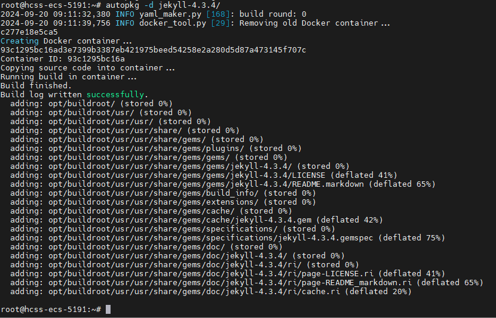
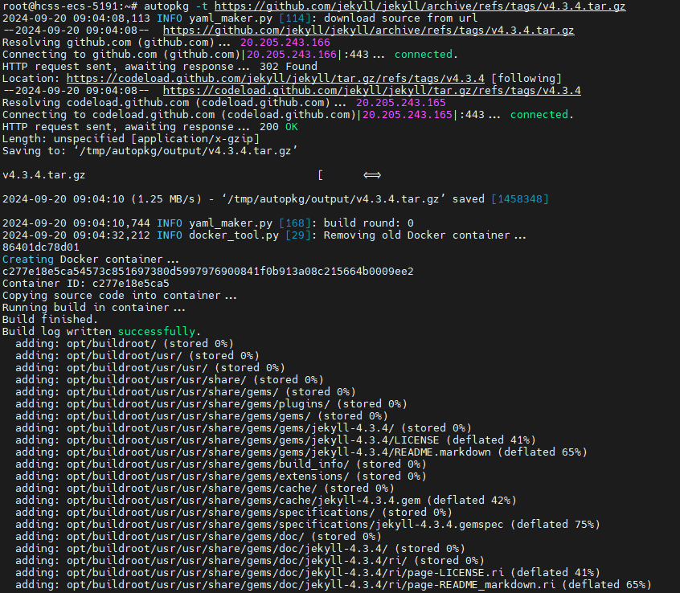
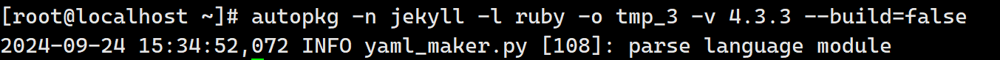
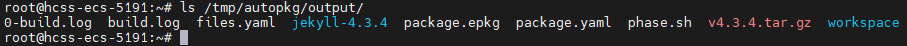

# autopkg用户指南

## 概述

本软件服务于`openEuler`社区，将`github`等公共平台上的开源代码仓批量加包到`openEuler`平台上，实现软件包依赖自动检测并编译生成二进制文件，替代手工编写与维护，支持`cmake/autotools/meson/maven/python`等多种构建方式，显著提升加包端到端成功率。

## 安装与卸载

### 1. 安装

从源码仓中下载源码。

```bash
git clone https://gitee.com/qiu-tangke/autopkg.git -b ${branch}
```

切到代码仓目录下，使用`pip`安装软件，仅支持openeuler-22.03-lts及更高版本的openeuler系统（其他版本需自行安装python3.8以上的环境）。

```bash
pip install dist/autopkg-***-py3-none-any.whl
```

### 2. 卸载

```bash
pip uninstall autopkg
```

## 快速入门

### 1. 环境准备

使用该软件需要在宿主机上运行，并且需要能启动docker容器。
预制`openEuler`系统的`docker`镜像，方法如下：

#### 方法1 直接下载源码中心仓的autopkg环境镜像

```bash
arch=$(uname -m)
if [ "$arch" == "aarch64" ]; then
    wget https://cache-openeuler.obs.cn-north-4.myhuaweicloud.com/52f2b17e15ceeefecf5646d7711df7e94691ea1adb11884b926532ae52ab3c22/autopkg-latest_aarch64.tar.xz
    docker load < autopkg-latest_aarch64.tar.xz
elif [ "$arch" == "x86_64" ]; then
    wget https://cache-openeuler.obs.cn-north-4.myhuaweicloud.com/710a5f18188efc70bfa0119d0b35dcbb62cab911c9eb77b86dc6aebdbbfc69de/autopkg-latest_x86-64.tar.xz
    docker load < autopkg-latest_x86-64.tar.xz
else
    echo "Error: The system architecture is neither aarch64 nor x86_64, it is $arch."
fi
```

#### 方法2 逐个使用命令生成镜像（方法1不成功时选择方法2）

```bash
arch=$(uname -m)
wget "https://repo.huaweicloud.com/openeuler/openEuler-23.03/docker_img/${arch}/openEuler-docker.${arch}.tar.xz"
docker load < "openEuler-docker.${arch}.tar.xz"
docker run -dti --privileged --name=autopkg_working --network=host openEuler-23.03:latest
docker exec -ti ${container_id} bash  # 以下命令在容器中执行
yum install -y git make gcc cmake python3-pip ruby ruby-devel rubygems-devel npm maven automake perl wget curl meson
cat >> /root/phase.sh << EOF
#/usr/bin/env bash

prep
build
install
EOF
exit  # 退出容器
docker commit ${container_id} > autopkg:latest  # 保存容器操作
docker tag ${new_image_id} autopkg:latest  # 操作镜像的名称和标签
```

### 2. 命令行

```bash
autopkg --help
-g,--git-url:  输入git仓库地址，形如'https://***.git'
-t,--tar-url:  输入tar包地址
-d,--dir:      输入本地仓库路径
-n,--name:     输入包名，仅用于接口请求信息时的输入
-v,--version:  输入版本，输入name时配合的参数
-l,--language: 输入语言，输入name时配合的参数
-o,--output:   设置输出文件的路径
-b,--build:    是否需要设置日志模式为debug
-c,--config:   设置可直接使用的配置信息
```

### 3. 常用命令

#### A. 输入本地仓库路径的形式

```bash
autopkg -d ${package_dir} -o ${output_path}
```



#### B. 输入源码包地址的形式

```bash
autopkg -t ${tar_url} -o ${output_path}
```



#### C. 输入包名且不编译的形式

```bash
autopkg -n ${name} -v ${version} -l ${language} -o ${output_path}
```



## 输出文件说明

软件包编译完成后会生成`package.yaml`，`phase.sh`和`{package_name}.epkg`。不编译的情况下只生成`package.yaml`和`phase.sh`文件，输出路径为--output参数指定的路径，默认为`/tmp/autopkg/output`。

### 1. package.yaml（jekyll为例，ruby编译）

记录软件包的基本信息参数：

```yaml
meta:
  summary: No detailed summary available
  description: |
    # [Jekyll](https://jekyllrb.com/)
name: jekyll
version: 4.3.3
homepage: https://localhost:8080/jekyll-0.0.1.tar.gz
license: MIT
source:
  '0': https://localhost:8080/jekyll-0.0.1.tar.gz  # 输入本地仓库时，url会采用本地服务模拟的url
release: 0
buildRequires:
- ruby
- ruby-devel
- rubygems-devel
```

### 2. phase.sh（jekyll为例，ruby编译）

软件包的构建脚本：

```bash
#!/usr/bin/env bash

prep() {
    cd /root/workspace
}

build() {
    if [ -f *.gemspec ]; then
      gem build *.gemspec
    fi
    mkdir -p usr/
    gem install -V --local --build-root usr --force --document=ri,rdoc *.gem
}

install() {
    rm -rf /opt/buildroot
    mkdir /opt/buildroot
    cp -r usr/ /opt/buildroot
}
```

### 3. ***.epkg

软件包的安装包：


